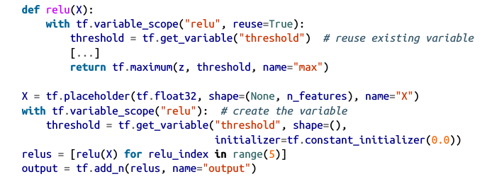

### 简介

> 写TensorFlow主要有两个步骤：  
> - 计算图定义；  
> - 执行

#### 1. 定义
``` python
import tensorflow as tf  
x = tf.Variable(3, name="x") # 定义变量x 
y = tf.Variable(4, name="y")  
f = x*x*y + y + 1  
```

此处代码仅仅定义了计算图，但未执行

#### 2. 执行
``` python
with tf.Session() as sess:
    x.initializer.run()
    y.initializer.run()
    result = f.eval()
```

上面的代码初始化了变量，并执行，更简洁的方式如下：

``` python
init = tf.global_variables_initializer()
with tf.Session() as sess:
    init.run()
    result = f.eval()
```

### 管理图
tensorflow中，有一个默认的graph: tf.get_default_graph()
同时，你也可以创建自己的graph:
```python
graph = tf.Graph()
with graph.as_default():
	...
```

### 使用Tensorflow实现线性回归
``` python
import numpy as np
from sklean.datasets import fetch_california_housing

housing = fetch_california_housing()
m, n = housing.data.shape
housing_data_plus_bias = np.c_[np.ones((m, 1)), housing.data]

X = tf.constant(housing_data_plus_bias, dtype=tf.float32, name="X")
y = tf.constant(housing.target.reshape(-1, 1), dtype=tf.float32, name="y")
XT = tf.transpose(X)
theta = tf.matmul(tf.matmul(tf.matrix_inverse(tf.matmul(XT, X)), XT), y)

with tf.Session() as sess:
	theta_value = theta.eval()
```
### 实现梯度下降
上面的线性回归直接对等式进行转换，接下来使用梯度下降法。
#### 手动计算梯度
``` python
n_epochs = 1000  # 
learning_rate = 0.01 # 学习率

X = tf.constant(scaled_housing_data_plus_bias, dtype=tf.float32, name="X")
y = tf.constant(housing.target.reshape(-1, 1), dtype=tf.float32, name="y")
# random_uniform生成[-1.0, 1.0]区间，大小的(n+1)*1的随机矩阵
theta = tf.Variable(tf.random_uniform([n+1, 1], -1.0, 1.0), name="theta")
y_pred = tf.matmul(X, theta, name="predictions") # 预测值
error = y_pred - y # 误差
# 最小均方误差, 
mse = tf.reduce_mean(tf.square(error), name="mse")
gradients = 2/m * tf.matmul(tf.transpose(X), error) # 梯度
# 赋值，theta赋新值
training_op = tf.assign(theta, theta - learning_rate * gradients)
init = tf.global_variables_initializer() # 初始化

with tf.Session() as sess:
	sess.run(init)
	for epoch in range(n_epochs):
		if epoch % 100 == 0:
			print("Epoch", epoch, "MSE = ", mse.eval())
		sess.run(traning_op)

best_theta = theta.eval()
```
上面的代码为使用TensorFlow计算梯度朴素的方法，然而这种方法有个问题：效率不高，而且代码多容易出错。TensorFlow的autodiff可以解决这种问题，它能自动高效计算梯度。

#### autodiff
使用autodiff只需将上面的gredients = ...一行替换成下面的代码即可：
```python
gradients = tf.gradients(mse, [theta])[0]
```
gradients()函数的参数为一个操作数(mse)， 一个变量的列表，然后会返回相应变量的ops列表。
#### 使用优化器
TensorFlow中一种更为方便计算梯度的方式是使用优化器：
```python
optimizer = tf.train.GradientDescentOptimizer(learning_rate=learning_rate)
training_op = optimizer.minimize(mse)
```
同样，你也可以使用其它优化器，例如MomentumOptimizer

### 为训练算法投喂数据
TensorFlow中一种普遍的赋值方式是使用placeholder，placeholder不会做实质的计算，它只会在运行时使用feed_dict执行数据的赋值，下面是实现小批次的梯度下降：
```python
# placeholder有三个参数，第一个参数为变量的类型，第二个为形状大小，第三个为变量名
# 其中，形状设置为None表示任意大小
X = tf.placeholder(tf.float32, shape=(None, n+1), name="X")
y = tf.placeholder(tf.float32, shape=(None, 1), name=y)

batch_size = 100
n_batches = int(np.ceil(m/batch_size))
# 数据批量加载
def fetch_batch(epoch, batch_index, batch_size):
	[...] # load data
	return X_batch, y_batch
# 执行阶段，使用feed_dict参数提供值
init = tf.global_variables_initializer()
with tf.Session() as sess:
	sess.run(init)
	
	for epoch in range(n_epoches):
		for batch_index in range(n_batches):
			X_batch, y_batch = fetch_batch(epoch, batch_index, batch_size)
			sess.run(training_op, feed_dict={X:X_batch, y:y_batch})
	best_theta = theta.eval()
```
### 保存和恢复模型
保存模型有以下两个优点：
1. 训练后将参数存入磁盘，以便能在其它程序中使用，这样减少了重新训练的工作；
2. 设置保存点，以防止训练过程中程序奔溃后重新训练，在奔溃后，只需从磁盘中恢复相应参数即可

#### 保存模型
保存模型很简单，只需在构造图后定义一个Saver，在执行阶段中需要保存变量时执行save()函数即可：
```python
[...]
theta = tf.Variable(tf.random_uniform([n+1, 1], -1.0, 1.0), name="theta")
[...]
init = tf.global_variables_initializer()
saver = tf.train.Saver() # 定义Saver

with tf.Session() as sess:
	sess.run(init)
	
	for epoch in range(n_epochs):
		if epoch % 100 == 0:
			save_path = saver.save(sess, "path/to/save/model.ckpt")
		sess.run(trainig_op)
		
	best_theta = theta.eval()
	save_path = saver.save(sess, "path/to/save/model.ckpt")
```

#### 恢复模型
恢复模型也很简单，同样在构造图完成时定义Saver，然后将sess.run(init)替换为saver.restore(sess, "path/to/save/model.ckpt")即可：
```python
with tf.Session() as sess:
	saver.restore(sess, "path/to/save/model.ckpt")
	[...]
```
### 模型可视化
模型可视化有识别图中的错误、发现瓶颈等优点，TensorFlow提供了TensorBoard实现图的可视化。
```python
from datetime import datetime

now = datetime.utcnow().strftime("%Y%m%d%H%M%S")
root_logdir = "tf_logs"
# 每次日志写入的路径不能相同，否则TensorFlow会整合同一路径下的所有日志文件
logdir = "{}/run-{}/".format(root_logdir, now)
# 接着，将下面两行代码放到构造图阶段的最后
mse_summary = tf.summary.scalar("MSE", mse) # 该行代码创建一个图节点，它将计算MSE值，并将它写入一个叫summary的TensorBoard-compatible二进制日志
file_writer = tf.summary.FileWriter(logdir, tf.get_default_graph())

# 在执行阶段，只需将相应的summary放入file_writer即可
[...]
for batch_index in range(n_batches):
	X_batch, y_batch = fetch_batch(epoch, batch_index, batch_size)
	if batch_index % 10 == 0:
		summary_str = mse_summary.eval(feed_dict={X:X_batch, y:y_batch})
		step = epoch * n_batches + batch_index
		file_writer.add_summary(summary_str, step)
	sess.run(training_op. feed_dict={X:X_batch, y:y_batch})
[...]
file_writer.close()
```

在训练完成后，进入log日志路径，执行tensorboard --logdir tf_logs/，这时可在浏览器中查看
	
### 名字空间
在处理复杂的模型时，这时会有很多节点，很容易导致混乱，为了避免这种情况，可使用TensorFlow的名字空间:
```python
with tf.name_scope("loss") as scope:
	error = y_pred - y
	mse = tf.reduce_mean(tf.square(error), name="mse")
```
上面的代码其实产生了一个以"loss/"为前缀的名字，这样就避免了名字的混乱。
	
### 模块化

### 共享变量
> TensorFlow 使用 get_variable() 来处理共享变量：不存在则创建，存在则复用。他的行为（创建还是复用）通过 variable_scope() 来控制：

```python
with tf.variable_scope("relu"):
	threshold = tf.get_variable("threshold", shape=(), initializer=tf.constant_initializer(0.0))
```
这段代码会生成一个名为"relu/threshold"的变量，如果前面已经定义了，则这段代码会抛出异常，如果想重用变量，则需要显示设置reuse参数为True:
```python
with tf.variable_scope("relu", reuse=True):
	threshold = tf.get_variable("threshold")
```
